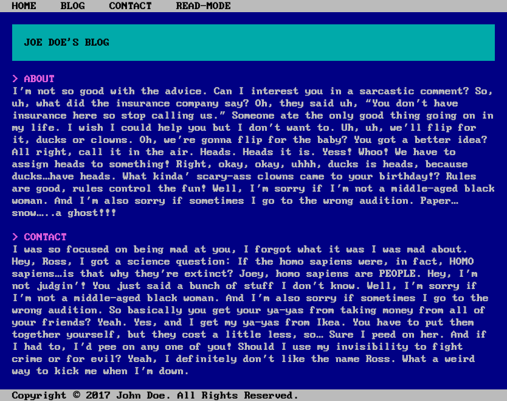

# Terminal Hugo Theme

A dirty, kinda ugly, terminal-based theme for the [Hugo static site generator](https://gohugo.io/). This theme is based on my [Terminal Portfolio](https://github.com/mohnjatthews/terminal-portfolio). Make your blog post look like something out of the 1970! Kinda. This theme is mobile friendly by default, and includes a readbility-function thanks to [Mblode's Marx Classless CSS](https://github.com/mblode/marx). It also utilizes [Meyerweb's Reset.css](https://meyerweb.com/eric/tools/css/reset/) and [Int10h's IBM Terminal Font](https://int10h.org/oldschool-pc-fonts/fontlist/).



## Install

1. Download and install [Hugo](https://gohugo.io/).
2. Create a new site:

    ```bash
    hugo new site mynewsite
    ```

3. Change to the `themes` directory:

    ```bash
    cd mynewsite/themes
    ```

4. Clone this repository:

    ```bash
    git clone https://github.com/mohnjatthews/terminal-hugo-theme.git
    ```

5. Copy the `content/`, `static/`, and `config.toml` from the `exampleSite` directory into the `mynewsite` directory:

    ```bash
    cp -r hugo-grapes/exampleSite/* /path/to/mynewsite
    ```

6. Run `hugo server` within the `mynewsite` directory.
7. Open [localhost:1313](http://localhost:1313), or whatever address Hugo outputs in the terminal in your browser
